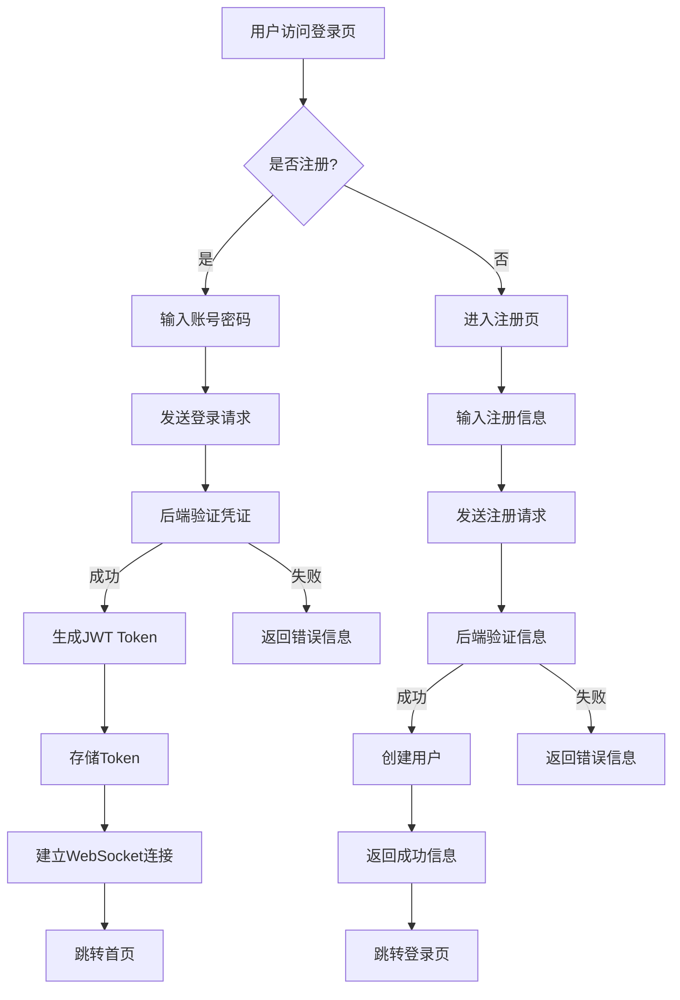
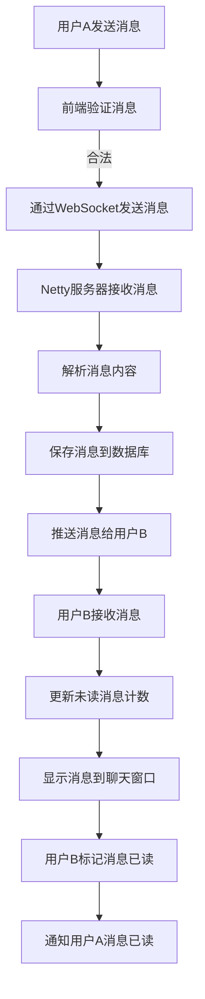
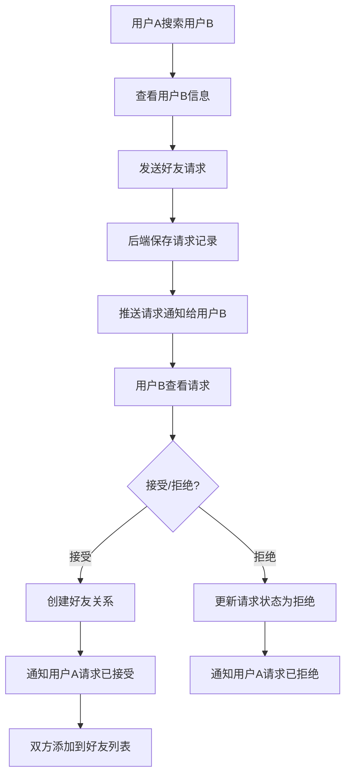
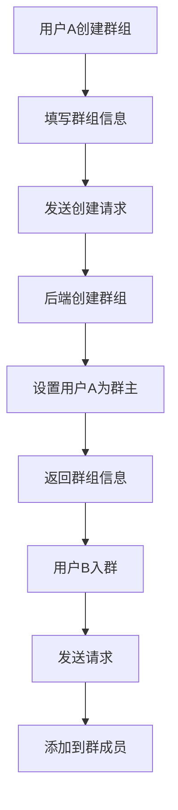
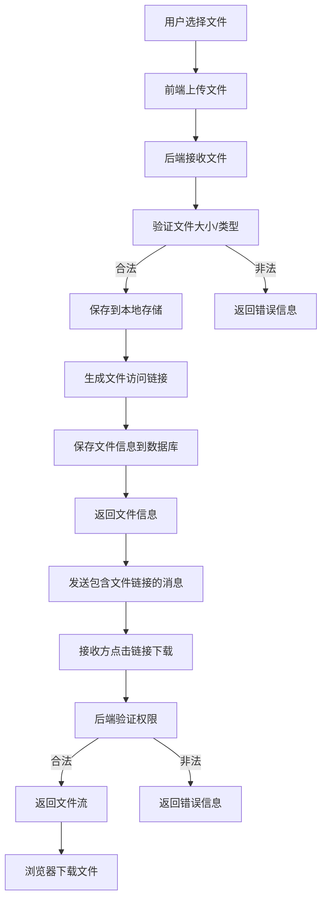

# FenDou_Chat在线聊天室项目技术分析报告

## 1. 项目概述

### 项目名称
在线聊天室系统（FenDou_Chat）

### 项目目标/解决的核心问题
本项目旨在构建一个功能完整、性能优良的在线实时通信系统，解决用户之间实时消息传递、文件共享、群组交流以及AI辅助聊天等核心需求，提供一个安全、稳定、易用的在线聊天平台。

### 目标用户或使用场景
- **个人用户**：进行一对一聊天、好友管理、文件分享
- **群组用户**：团队协作、兴趣小组交流、多人讨论
- **企业用户**：内部沟通、文件共享、团队协作
- **AI交互需求用户**：通过AI助手获取信息、解决问题

## 2. 系统功能模块

### 主要功能列表
| 模块 | 子模块 | 详细功能 |
|------|--------|----------|
| **用户认证与管理** | 用户注册 | 账号密码注册、密码设置、邮箱、手机号 |
| | 用户登录 | 账号密码登录 |
| | 个人信息管理 | 头像上传、昵称修改、个性签名、密码修改 |
| | 在线状态管理 | 在线/离线/状态切换 |
| **实时聊天功能** | 一对一聊天 | 文本消息、表情发送、已读状态 |
| | 群组聊天 | 群内消息发送、群公告、群成员列表 |
| | 消息历史记录 | 历史消息 |
| | 消息通知 | 新消息提醒、未读消息计数 |
| **好友管理** | 好友添加 | 搜索用户、发送好友请求、好友验证 |
| | 好友请求处理 | 接受/拒绝好友请求、查看请求历史 |
| | 好友列表管理 | 好友分组、好友备注、删除好友 |
| **群组管理** | 群组创建 | 创建群组、设置群名称/头像/公告 |
| | 群成员管理 | 踢人、设置管理员 |
| | 群组信息编辑 | 修改群名称/头像/公告、解散群组 |
| | 群组搜索 | 搜索群组、申请加入群组 |
| **文件管理** | 文件上传 | 文件上传                               |
| | 文件下载 | 单文件下载、批量下载 |
| | 文件预览 | 图片预览、文档在线预览 |
| | 文件管理 | 查看已上传文件、删除文件 |
| **AI聊天功能** | AI助手对话 | 与AI助手进行自然语言对话 |
| | AI功能扩展 | 历史对话记录是否记住等切换、个性化AI设置 |
| **收藏功能** | 消息收藏 | 收藏重要消息、分类管理收藏 |
| | 收藏夹管理 | 创建/编辑/删除收藏夹 |
| **系统管理** | 用户管理 | 查看/编辑/禁用用户、设置用户角色 |
| | 群组管理 | 查看/编辑/解散群组 |
| | 消息管理 | 查看消息记录、删除违规消息 |
| | 文件管理 | 查看/删除文件 |
| | 系统设置 | 系统参数配置、主题设置、系统介绍 |

### 权限控制与多角色支持
- 支持**多角色**：普通用户、管理员
- 权限控制：
  - **普通用户**：聊天、好友管理、群组管理、文件管理、AI聊天、个人信息管理
  - **管理员**：用户管理、群组管理、消息管理、文件管理、系统设置

### 第三方服务集成
- **AI API**：集成AI聊天功能，支持与AI助手进行对话
- **WebSocket**：使用Netty实现实时通信

## 3. 整体架构设计

### 系统架构
- **前后端分离架构**
  - 前端：Vue 3 + Vite
  - 后端：Spring Boot 3.1.5
- **单体应用**：当前为单体架构，便于开发和部署
- **支持Docker部署**：提供Dockerfile和docker-compose配置

### 部署架构
- **容器化部署**：使用Docker容器化应用
- **服务编排**：提供docker-compose.yml，支持一键部署
- **Nginx反向代理**：前端静态资源通过Nginx分发
- **本地存储**：文件存储使用本地文件系统，便于部署和管理

### 数据流流转
```
用户请求 → 前端Vue应用 → HTTP API/WebSocket → Spring Boot后端 → 
(1) 业务逻辑处理 → MySQL数据库/Redis缓存
(2) 文件操作 → 本地文件系统
(3) AI请求 → 外部AI服务
```

## 4. 功能介绍和流程介绍

### 核心业务流程图

#### 4.1 用户注册登录流程


#### 4.2 一对一聊天流程


#### 4.3 好友添加流程


#### 4.4 群组创建与成员管理流程


#### 4.5 文件上传与分享流程


### 功能分级介绍
| 级别 | 功能模块 | 优先级 | 描述 |
|------|----------|--------|------|
| **核心功能** | 实时聊天、用户认证、好友管理、群组管理 | 高 | 系统必须具备的基础功能，确保聊天系统的核心价值 |
| **扩展功能** | 文件管理、AI聊天、收藏功能 | 中 | 增强用户体验的扩展功能，提升系统竞争力 |
| **管理功能** | 用户管理、群组管理、消息管理、文件管理、系统设置 | 中 | 确保系统安全、稳定运行的管理功能 |

## 5. 前端技术栈

### 框架及版本
- **Vue 3.5.18**：采用Composition API，提供更好的类型支持和性能
- **Vue Router 4.5.1**：官方路由库，实现页面路由管理

### 状态管理方案
- **Pinia 2.3.1**：Vue 3推荐的状态管理库，提供更简洁的API和更好的TypeScript支持
- **模块划分**：userStore（用户状态）、websocketStore（WebSocket状态）、themeStore（主题状态）

### 构建工具
- **Vite 5.4.19**：现代化前端构建工具，提供快速的开发体验和优化的构建输出
- **插件**：@vitejs/plugin-vue（Vue插件）、vite-plugin-compression（代码压缩）

### UI组件库
- **Element Plus 2.10.4**：基于Vue 3的企业级UI组件库，提供丰富的组件和良好的用户体验
- **@element-plus/icons-vue 2.3.1**：Element Plus官方图标库
- **emoji-mart-vue-fast 15.0.4**：表情选择器组件

### 其他重要库
- **axios 1.11.0**：HTTP客户端，用于前后端API通信
- **nprogress 0.2.0**：页面加载进度条，提升用户体验
- **vue-clipboard3 2.0.0**：剪贴板操作，支持复制粘贴功能
- **sass 1.89.2**：CSS预处理器，增强样式编写能力

### 响应式与性能优化
- **响应式设计**：适配不同屏幕尺寸，支持桌面端和移动端
- **代码分割**：通过Vite实现自动代码分割，优化加载性能
- **按需加载**：Element Plus组件按需引入，减少打包体积
- **WebSocket连接管理**：优化实时通信性能，支持断线重连
- **图片懒加载**：提升页面加载速度
- **缓存策略**：合理使用localStorage和sessionStorage，减少重复请求

## 6. 后端技术栈

### 编程语言与框架
- **Java 17**：现代化Java版本，提供更好的性能和语言特性
- **Spring Boot 3.1.5**：Java生态主流的Web框架，简化开发和部署
- **Spring MVC**：实现RESTful API设计
- **MyBatis Plus 3.5.5**：ORM框架，简化数据库操作
- **WebSocket**：消息处理

### API设计风格
- **RESTful API**：采用RESTful设计风格，提供清晰的API接口
- **统一响应格式**：所有API返回统一的JSON格式，包含状态码、消息和数据
- **API版本控制**：支持API版本管理，便于后续扩展

### 身份认证与授权机制
- **JWT**：使用JSON Web Token进行身份认证，无状态设计，便于水平扩展
- **拦截器**：JwtInterceptor实现请求拦截和权限验证
- **权限管理**：基于角色的权限控制，区分普通用户和管理员权限

### 中间件与缓存
- **Netty 4.x**：高性能网络通信框架，用于实现WebSocket实时通信，支持大规模并发连接
- **Redis 7.x**：用于缓存热点数据、存储会话信息、实现分布式锁、存储在线用户状态
- **MySQL 8.0.33**：关系型数据库，用于存储用户、消息、群组等结构化数据

## 7. 数据库与存储

### 使用的数据库类型
- **MySQL 8.0.33**：关系型数据库，用于存储用户、消息、群组等结构化数据
- **Redis**：内存数据库，用于缓存和实时数据处理

### 核心表结构设计
| 表名 | 主要字段 | 用途 |
|------|----------|------|
| **user** | id, username, password, nickname, avatar, status, create_time, update_time | 存储用户基本信息 |
| **message** | id, chat_id, sender_id, content, type, read_status, create_time | 存储聊天消息 |
| **user_friend** | id, user_id, friend_id, remark, create_time | 存储好友关系 |
| **friend_request** | id, from_user_id, to_user_id, status, create_time, update_time | 存储好友请求 |
| **group** | id, name, avatar, owner_id, announcement, create_time | 存储群组信息 |
| **group_member** | id, group_id, user_id, role, join_time | 存储群组成员信息 |
| **file** | id, user_id, name, path, size, type, create_time | 存储文件信息 |
| **favorite** | id, user_id, content, type, create_time | 存储收藏信息 |

### 表结构设计亮点
- **BasePOJO**：所有实体类继承BasePOJO，统一管理id、创建时间、更新时间等公共字段
- **索引优化**：根据查询需求设计合理索引，如message表的chat_id和create_time索引，提高消息查询效率
- **关联表设计**：用户好友、群组成员等使用关联表设计，便于多对多关系管理
- **状态字段设计**：使用枚举类型管理用户状态、消息类型、好友请求状态等，提高代码可读性和维护性

### 文件存储
- **本地存储**：文件存储在本地文件系统，通过配置文件设置存储路径
- **存储路径管理**：通过StorageProperties配置文件统一管理存储路径
- **文件访问控制**：通过API接口控制文件访问权限，确保文件安全
- **文件命名策略**：采用UUID生成唯一文件名，避免文件名冲突

## 8. 项目亮点与创新点

### 技术上的创新
- **前后端分离架构**：采用现代化的前后端分离设计，提高开发效率和系统可维护性
- **WebSocket实时通信**：基于Netty实现高性能的WebSocket通信，支持大规模并发连接，确保消息实时性和可靠性
- **模块化设计**：后端采用清晰的模块化结构，便于扩展和维护，包括controller、service、mapper、domain等分层设计
- **AI集成**：内置AI聊天功能，提升用户体验，支持与AI助手进行自然语言对话
- **统一异常处理**：实现GlobalExceptionHandler，统一处理系统异常，返回友好的错误信息

### 用户体验上的优势
- **现代化UI设计**：采用Element Plus组件库，提供美观、易用的用户界面，符合现代设计趋势
- **实时消息推送**：支持消息实时推送，无需刷新页面，确保消息及时性
- **流畅的交互体验**：优化的前端性能，提供流畅的用户交互，包括消息发送、表情选择、文件上传等
- **丰富的功能集**：集成聊天、好友管理、群组管理、文件管理、AI聊天等多种功能，满足用户多样化需求
- **响应式设计**：适配不同屏幕尺寸，支持桌面端和移动端，提供一致的用户体验

### 安全性、可扩展性、可观测性
- **安全性**：
  - JWT身份认证，防止未授权访问
  - 密码加密存储，使用BCrypt等安全算法
  - 权限控制，区分普通用户和管理员权限
  - 输入验证，防止SQL注入、XSS等攻击
  - 文件上传验证，限制文件大小和类型，防止恶意文件上传
- **可扩展性**：
  - 模块化设计，便于功能扩展
  - 配置化管理，支持通过配置文件调整系统参数
  - 前后端分离，便于独立扩展
  - 支持Docker部署，便于水平扩展
- **可观测性**：
  - 支持日志记录，便于问题排查和系统监控
  - 提供统一的API响应格式，便于前端处理和调试
  - 支持系统状态监控，包括在线用户数、消息吞吐量等

## 9. 总结与建议

### 项目优势
- **技术栈选型合理**：采用现代化的前后端技术，包括Vue 3、Spring Boot 3、Netty等，确保系统性能和可维护性
- **功能完整**：覆盖了聊天系统的核心需求，包括实时聊天、好友管理、群组管理、文件管理、AI聊天等
- **架构设计清晰**：前后端分离架构，模块化设计，便于扩展和维护
- **用户体验良好**：现代化的UI设计，流畅的交互体验，实时消息推送
- **部署方便**：提供Dockerfile和docker-compose配置，支持一键部署

### 未来发展方向
- **支持更多AI功能**：集成更多AI能力，如智能推荐、内容审核、自动翻译等
- **支持语音和视频通话**：扩展实时通信功能，支持语音和视频通话，提升用户体验
- **支持第三方登录**：集成微信、QQ、GitHub等第三方登录，提高用户注册转化率
- **微服务架构**：对于大规模应用，考虑升级为微服务架构，提高系统的可扩展性和可靠性
- **支持插件化扩展**：提供插件机制，允许开发者扩展系统功能，如自定义表情、主题等
- **支持企业级功能**：如消息加密、权限细粒度控制、审计日志等，满足企业级用户需求

